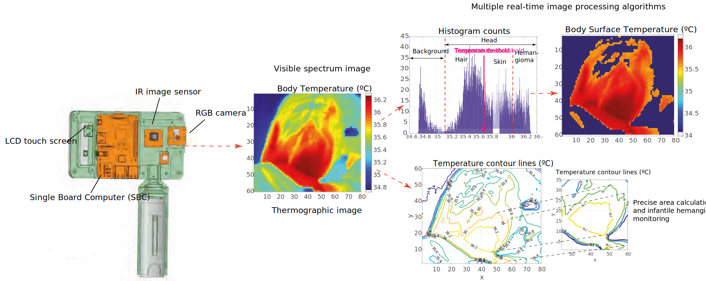

# Biomedical IR Project
## Source code to control a biomedical IR image acquisition system, process, and display medical images

Summary: This code controls the biomedical image acquisition system described in this publication: https://doi.org/10.1109/JSEN.2021.3080035
To run the code, you must install the OpenCV libraries and use a C++ compiler.
The code opens a graphical interface to acquire images with an IR and visible image sensor. The user can capture snapshots simultaneously with the two cameras. 
There are extra routines to calibrate the IR sensor and to implement real-time processing of the IR images.
